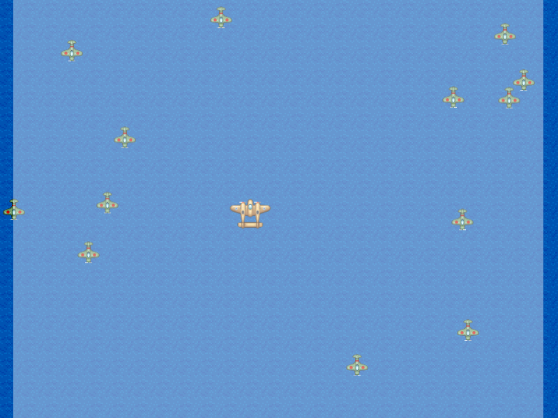
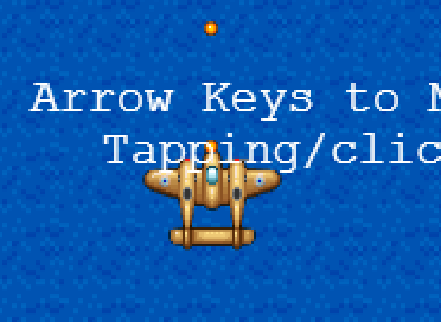
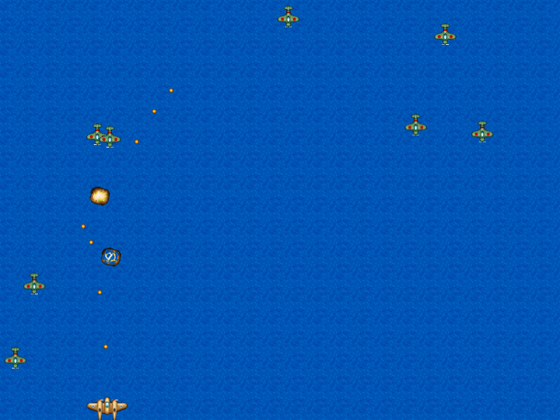

# Afternoon 3: Object Groups

Instead of creating objects on the fly, we can create [_Groups_](http://docs.phaser.io/Phaser.Group.html) where we can use and re-use sprites over and over again.

## Convert Bullets to Sprite Group

Bullets are best use case for groups in our game; they're constantly being generated and removed from play. Having a pool of available bullets will save our game time and memory.

Let's begin by switching out our array with a sprite group. The comments below explain our new code.

{linenos=off,lang="js"}
~~~~~~~~
  create: function () {
    ...
{leanpub-start-delete}
    this.bullets = [];
{leanpub-end-delete}
{leanpub-start-insert}
    // Add an empty sprite group into our game
    this.bulletPool = this.add.group();

    // Enable physics to the whole sprite group
    this.bulletPool.enableBody = true;
    this.bulletPool.physicsBodyType = Phaser.Physics.ARCADE;

    // Add 100 'bullet' sprites in the group.
    // By default this uses the first frame of the sprite sheet and
    //   sets the initial state as non-existing (i.e. killed/dead)
    this.bulletPool.createMultiple(100, 'bullet');

    // Sets anchors of all sprites
    this.bulletPool.setAll('anchor.x', 0.5);
    this.bulletPool.setAll('anchor.y', 0.5);

    // Automatically kill the bullet sprites when they go out of bounds
    this.bulletPool.setAll('outOfBoundsKill', true);
    this.bulletPool.setAll('checkWorldBounds', true);

{leanpub-end-insert}
    this.nextShotAt = 0;
~~~~~~~~

Let's move on to the `fire()` function:

{linenos=off,lang="js"}
~~~~~~~~
  fire: function() {
    if (this.nextShotAt > this.time.now) {
      return;
    }

{leanpub-start-insert}
    if (this.bulletPool.countDead() === 0) {
      return;
    }
{leanpub-end-insert}

    this.nextShotAt = this.time.now + this.shotDelay;

{leanpub-start-delete}
    var bullet = this.add.sprite(this.player.x, this.player.y - 20, 'bullet');
    bullet.anchor.setTo(0.5, 0.5);
    this.physics.enable(bullet, Phaser.Physics.ARCADE);
    bullet.body.velocity.y = -500;
    this.bullets.push(bullet);
{leanpub-end-delete}

{leanpub-start-insert}
    // Find the first dead bullet in the pool
    var bullet = this.bulletPool.getFirstExists(false);

    // Reset (revive) the sprite and place it in a new location
    bullet.reset(this.player.x, this.player.y - 20);

    bullet.body.velocity.y = -500;
{leanpub-end-insert}
  },
~~~~~~~~

Here we replaced creating bullets on the fly with [reviving](http://docs.phaser.io/Phaser.Sprite.html#reset) dead bullets in our pool.

### Update collision detection

Switching from array to group means we need to modify our collision checking code. Good news is that `overlap()` supports Group to Sprite collision checking.

{linenos=off,lang="js"}
~~~~~~~~
  update: function () {
    this.sea.tilePosition.y += 0.2;
{leanpub-start-delete}
    for (var i = 0; i < this.bullets.length; i++) {
      this.physics.arcade.overlap(
        this.bullets[i], this.enemy, this.enemyHit, null, this
      );
    }
{leanpub-end-delete}
{leanpub-start-insert}
    this.physics.arcade.overlap(
      this.bulletPool, this.enemy, this.enemyHit, null, this
    );
{leanpub-end-insert}
~~~~~~~~

Bad news is that there seems to be a bug when comparing "Groups to Sprites" (see if you can notice it) but not in "Sprite to Groups" or "Group to Groups". This shouldn't be a problem since we're only doing the latter two.

## Enemy Sprite Group

Our game would be boring if we only had one enemy. Let's make a sprite group so that we can generate a bunch more enemies so that they can start giving us a challenge:

{linenos=off,lang="js"}
~~~~~~~~
{leanpub-start-delete}
    this.enemy = this.add.sprite(512, 300, 'greenEnemy');
    this.enemy.anchor.setTo(0.5, 0.5);
    this.enemy.animations.add('fly', [ 0, 1, 2 ], 20, true);
    this.enemy.play('fly');
    this.physics.enable(this.enemy, Phaser.Physics.ARCADE);
{leanpub-end-delete}
{leanpub-start-insert}
    this.enemyPool = this.add.group();
    this.enemyPool.enableBody = true;
    this.enemyPool.physicsBodyType = Phaser.Physics.ARCADE;
    this.enemyPool.createMultiple(50, 'greenEnemy');
    this.enemyPool.setAll('anchor.x', 0.5);
    this.enemyPool.setAll('anchor.y', 0.5);
    this.enemyPool.setAll('outOfBoundsKill', true);
    this.enemyPool.setAll('checkWorldBounds', true);

    // Set the animation for each sprite
    this.enemyPool.forEach(function (enemy) {
      enemy.animations.add('fly', [ 0, 1, 2 ], 20, true);
    });

    this.nextEnemyAt = 0;
    this.enemyDelay = 1000;
{leanpub-end-insert}
~~~~~~~~

And again, modifying the collision code become Group to Group:

{linenos=off,lang="js"}
~~~~~~~~
    this.physics.arcade.overlap(
{leanpub-start-delete}
      this.bulletPool, this.enemy, this.enemyHit, null, this
{leanpub-end-delete}
{leanpub-start-insert}
      this.bulletPool, this.enemyPool, this.enemyHit, null, this
{leanpub-end-insert}
    );
~~~~~~~~

### Randomize Enemy Spawn

Many games have enemies show up at scripted positions. We don't have time for that so we'll just randomize the spawning locations. 

Add this to the `update()` function:

{linenos=off,lang="js"}
~~~~~~~~
  update: function () {
    this.sea.tilePosition.y += 0.2;
    this.physics.arcade.overlap(
      this.bulletPool, this.enemyPool, this.enemyHit, null, this
    );

{leanpub-start-insert}
    if (this.nextEnemyAt < this.time.now && this.enemyPool.countDead() > 0) {
      this.nextEnemyAt = this.time.now + this.enemyDelay;
      var enemy = this.enemyPool.getFirstExists(false);
      // spawn at a random location top of the screen
      enemy.reset(this.rnd.integerInRange(20, 1004), 0);
      // also randomize the speed
      enemy.body.velocity.y = this.rnd.integerInRange(30, 60);
      enemy.play('fly');
    }
{leanpub-end-insert}

    this.player.body.velocity.x = 0;
    this.player.body.velocity.y = 0;
~~~~~~~~

Like our `bulletPool`, we also store the next time an enemy should spawn.

Note that we did not use `Math.random()` to set the random enemy spawn location and speed but instead used the built-in randomizing functions. Either way is fine, but we chose the [built in random number generator](http://docs.phaser.io/Phaser.Game.html#rnd) because it has some additional features that may be useful later (e.g. seeds).

## Player Death

Let's further increase the challenge by allowing our plane to blow up.

Let's first add the collision detection code:

{linenos=off,lang="js"}
~~~~~~~~
  update: function () {
    this.sea.tilePosition.y += 0.2;
    this.physics.arcade.overlap(
      this.bulletPool, this.enemyPool, this.enemyHit, null, this
    );

{leanpub-start-insert}
    this.physics.arcade.overlap(
      this.player, this.enemyPool, this.playerHit, null, this
    );
{leanpub-end-insert}

    if (this.nextEnemyAt < this.time.now && this.enemyPool.countDead() > 0) {
~~~~~~~~

Then the callback:

{linenos=on,starting-line-number=140,lang="js"}
~~~~~~~~
{leanpub-start-insert}
  playerHit: function (player, enemy) {
    enemy.kill();
    var explosion = this.add.sprite(player.x, player.y, 'explosion');
    explosion.anchor.setTo(0.5, 0.5);
    explosion.animations.add('boom');
    explosion.play('boom', 15, false, true);
    player.kill();
  },
{leanpub-end-insert}
~~~~~~~~

You might notice that even though the plane blows up when we crash to another plane, we can still fire our guns. Let's fix that by checking the `alive` flag:

{linenos=off,lang="js"}
~~~~~~~~
  fire: function() {
{leanpub-start-delete}
    if (this.nextShotAt > this.time.now) {
{leanpub-end-delete}
{leanpub-start-insert}
    if (!this.player.alive || this.nextShotAt > this.time.now) {
{leanpub-end-insert}
      return;
    }

    if (this.bulletPool.countDead() === 0) {
      return;
    }
~~~~~~~~

Another possible issue is that our hitbox is too big because of our sprite. Let's [lower](http://docs.phaser.io/Phaser.Physics.Arcade.Body.html#setSize) our hitbox accordingly:

{linenos=off,lang="js"}
~~~~~~~~
    this.physics.enable(this.player, Phaser.Physics.ARCADE);
    this.player.body.collideWorldBounds = true;
{leanpub-start-insert}
    // 20 x 20 pixel hitbox, centered a little bit higher than the center
    this.player.body.setSize(20, 20, 0, -5);
{leanpub-end-insert}
~~~~~~~~

This hitbox is pretty small, but it's still on par with other shoot em ups (some "bullet hell" type games even have a 1 pixel hitbox). Feel free to increase this if you want a challenge.

Use the debug body function if you need to see your sprite's actual hitbox size.

{linenos=off,lang="js"}
~~~~~~~~
  render: function() {
{leanpub-start-insert}
    this.game.debug.body(this.player);
{leanpub-end-insert}
  }
~~~~~~~~

## Convert Explosions to Sprite Group

Our explosions are also a possible memory leak. Let's fix that and also do a bit of refactoring in the process.

Put this on the `create()` after all of the other sprites:

{linenos=off,lang="js"}
~~~~~~~~
    this.shotDelay = 100;

{leanpub-start-insert}
    this.explosionPool = this.add.group();
    this.explosionPool.enableBody = true;
    this.explosionPool.physicsBodyType = Phaser.Physics.ARCADE;
    this.explosionPool.createMultiple(100, 'explosion');
    this.explosionPool.setAll('anchor.x', 0.5);
    this.explosionPool.setAll('anchor.y', 0.5);
    this.explosionPool.forEach(function (explosion) {
      explosion.animations.add('boom');
    });
{leanpub-end-insert}

    this.cursors = this.input.keyboard.createCursorKeys();
~~~~~~~~

Then create a new function:

{linenos=on,starting-line-number=161,lang="js"}
~~~~~~~~
{leanpub-start-insert}
  explode: function (sprite) {
    if (this.explosionPool.countDead() === 0) {
      return;
    }
    var explosion = this.explosionPool.getFirstExists(false);
    explosion.reset(sprite.x, sprite.y);
    explosion.play('boom', 15, false, true);
    // add the original sprite's velocity to the explosion
    explosion.body.velocity.x = sprite.body.velocity.x;
    explosion.body.velocity.y = sprite.body.velocity.y;
  },
{leanpub-end-insert}
~~~~~~~~

And refactor the collision callbacks:

{linenos=off,lang="js"}
~~~~~~~~
  enemyHit: function (bullet, enemy) {
    bullet.kill();
{leanpub-start-insert}
    this.explode(enemy);
{leanpub-end-insert}
    enemy.kill();
{leanpub-start-delete}
    var explosion = this.add.sprite(enemy.x, enemy.y, 'explosion');
    explosion.anchor.setTo(0.5, 0.5);
    explosion.animations.add('boom');
    explosion.play('boom', 15, false, true);
{leanpub-end-delete}
  },

  playerHit: function (player, enemy) {
{leanpub-start-insert}
    this.explode(enemy);
{leanpub-end-insert}
    enemy.kill();
{leanpub-start-delete}
    var explosion = this.add.sprite(player.x, player.y, 'explosion');
    explosion.anchor.setTo(0.5, 0.5);
    explosion.animations.add('boom');
    explosion.play('boom', 15, false, true);
{leanpub-end-delete}
{leanpub-start-insert}
    this.explode(player);
{leanpub-end-insert}
    player.kill();
  },
~~~~~~~~

{pagebreak}

A> ## Sprite Ordering
A> 
A> We mentioned before that the ordering of sprites is determined by the time they are added into our game i.e. the first objects (sprites, text, etc) added are at the bottom while the later objects are at the top.
A> 
A> 
A> 
A> This is done through sprite groups: all objects (sprites, text, and even groups - groups can contain other groups) are added to the game's [`World`](http://docs.phaser.io/Phaser.World.html) by default, a special group in our game. Display order is then determined by iterating over the members of the `World`. 
A> 
A> For example, the order of the contents of `World` in the following scene is:
A> 
A> 
A> 
A> * The `sea` tile sprite is at the bottom.
A> * The `player` sprite is next.
A> * The `greenEnemy` sprite group is on the next level. Only a few sprites from this group are visible (the rest are still dead).
A> * Next is the `bullet` sprite group. Same as the enemy group, only a few sprites from this group are visible.
A> * Next is the `explosion` sprite group.
A> * At the top is the instructions text. It's not visible anymore at this point in the game.
A> 
A> (`World` is also contained in the `Stage` but we won't be using the `Stage` directly so we won't cover it.)

## Refactoring

Our `create()` and `update()` functions are getting bigger and it will be worse as we proceed with the workshop. We'll [_refactor_](http://en.wikipedia.org/wiki/Code_refactoring) them by [splitting these large functions into smaller functions](http://refactoring.com/catalog/extractMethod.html).

Here are the overhauled functions and the extracted ones:

{linenos=on,starting-line-number=15,lang="js"}
~~~~~~~~
  create: function () {
    this.sea = this.add.tileSprite(0, 0, 1024, 768, 'sea');

{leanpub-start-insert}
    this.setupPlayer();
    this.setupEnemies();
    this.setupBullets();
    this.setupExplosions();
    this.setupText();
{leanpub-end-insert}

    this.cursors = this.input.keyboard.createCursorKeys();
  },

  update: function () {
    this.sea.tilePosition.y += 0.2;

{leanpub-start-insert}
    this.checkCollisions();
    this.spawnEnemies();
    this.processPlayerInput();
    this.processDelayedEffects();
{leanpub-end-insert}
  },

  // create()-related functions
  
  setupPlayer: function () {
    this.player = this.add.sprite(400, 650, 'player');
    this.player.anchor.setTo(0.5, 0.5);
    this.player.animations.add('fly', [ 0, 1, 2 ], 20, true);
    this.player.play('fly');
    this.physics.enable(this.player, Phaser.Physics.ARCADE);
    this.player.speed = 300;
    this.player.body.collideWorldBounds = true;
    // 20 x 20 pixel hitbox, centered a little bit higher than the center
    this.player.body.setSize(20, 20, 0, -5);
  },

  setupEnemies: function () {
    this.enemyPool = this.add.group();
    this.enemyPool.enableBody = true;
    this.enemyPool.physicsBodyType = Phaser.Physics.ARCADE;
    this.enemyPool.createMultiple(50, 'greenEnemy');
    this.enemyPool.setAll('anchor.x', 0.5);
    this.enemyPool.setAll('anchor.y', 0.5);
    this.enemyPool.setAll('outOfBoundsKill', true);
    this.enemyPool.setAll('checkWorldBounds', true);

    // Set the animation for each sprite
    this.enemyPool.forEach(function (enemy) {
      enemy.animations.add('fly', [ 0, 1, 2 ], 20, true);
    });

    this.nextEnemyAt = 0;
    this.enemyDelay = 1000;
  },

  setupBullets: function () {
    // Add an empty sprite group into our game
    this.bulletPool = this.add.group();

    // Enable physics to the whole sprite group
    this.bulletPool.enableBody = true;
    this.bulletPool.physicsBodyType = Phaser.Physics.ARCADE;

    // Add 100 'bullet' sprites in the group.
    // By default this uses the first frame of the sprite sheet
    //   and sets the initial state as non-existing (i.e. killed)
    this.bulletPool.createMultiple(100, 'bullet');

    // Sets anchors of all sprites
    this.bulletPool.setAll('anchor.x', 0.5);
    this.bulletPool.setAll('anchor.y', 0.5);

    // Automatically kill the bullet sprites when they go out of bounds
    this.bulletPool.setAll('outOfBoundsKill', true);
    this.bulletPool.setAll('checkWorldBounds', true);

    this.nextShotAt = 0;
    this.shotDelay = 100;
  },
  
  setupExplosions: function () {
    this.explosionPool = this.add.group();
    this.explosionPool.enableBody = true;
    this.explosionPool.physicsBodyType = Phaser.Physics.ARCADE;
    this.explosionPool.createMultiple(100, 'explosion');
    this.explosionPool.setAll('anchor.x', 0.5);
    this.explosionPool.setAll('anchor.y', 0.5);
    this.explosionPool.forEach(function (explosion) {
      explosion.animations.add('boom');
    });
  },

  setupText: function () {
    this.instructions = this.add.text( 510, 600, 
      'Use Arrow Keys to Move, Press Z to Fire\n' + 
      'Tapping/clicking does both', 
      { font: '20px monospace', fill: '#fff', align: 'center' }
    );
    this.instructions.anchor.setTo(0.5, 0.5);
    this.instExpire = this.time.now + 10000;
  },

  // update()-related functions

  checkCollisions: function () {
    this.physics.arcade.overlap(
      this.bulletPool, this.enemyPool, this.enemyHit, null, this
    );

    this.physics.arcade.overlap(
      this.player, this.enemyPool, this.playerHit, null, this
    );
  },

  spawnEnemies: function () {
    if (this.nextEnemyAt < this.time.now && this.enemyPool.countDead() > 0) {
      this.nextEnemyAt = this.time.now + this.enemyDelay;
      var enemy = this.enemyPool.getFirstExists(false);
      enemy.reset(this.rnd.integerInRange(20, 1004), 0);
      enemy.body.velocity.y = this.rnd.integerInRange(30, 60);
      enemy.play('fly');
    }
  },

  processPlayerInput: function () {
    this.player.body.velocity.x = 0;
    this.player.body.velocity.y = 0;

    if (this.cursors.left.isDown) {
      this.player.body.velocity.x = -this.player.speed;
    } else if (this.cursors.right.isDown) {
      this.player.body.velocity.x = this.player.speed;
    }

    if (this.cursors.up.isDown) {
      this.player.body.velocity.y = -this.player.speed;
    } else if (this.cursors.down.isDown) {
      this.player.body.velocity.y = this.player.speed;
    }

    if (this.input.activePointer.isDown &&
        this.physics.arcade.distanceToPointer(this.player) > 15) {
      this.physics.arcade.moveToPointer(this.player, this.player.speed);
    }

    if (this.input.keyboard.isDown(Phaser.Keyboard.Z) ||
        this.input.activePointer.isDown) {
      this.fire();
    }
  },

  processDelayedEffects: function () {
    if (this.instructions.exists && this.time.now > this.instExpire) {
      this.instructions.destroy();
    }
  },
~~~~~~~~

