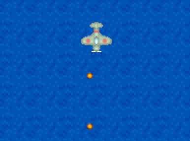
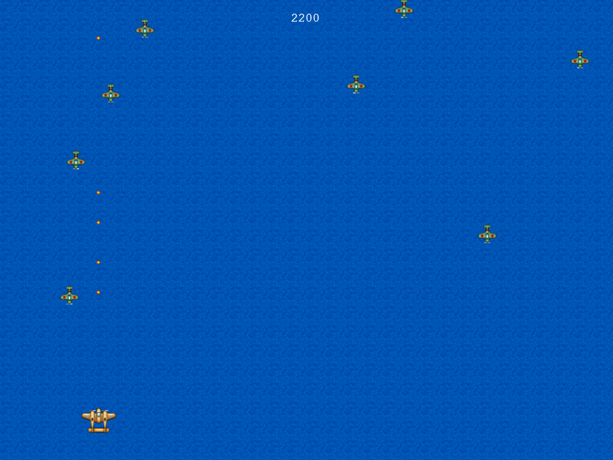
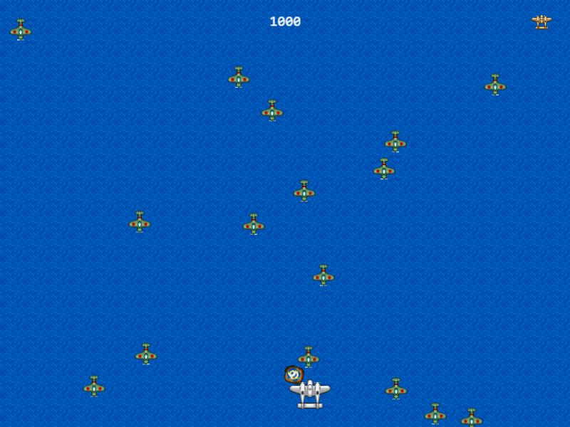
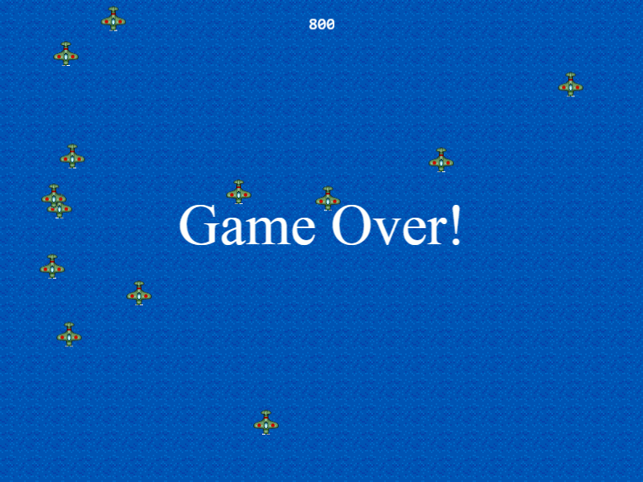
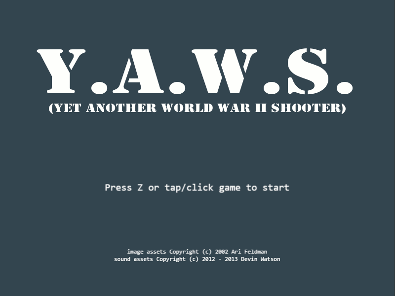

# Afternoon 4: Health, Score, and Win/Lose Conditions

Our game looks more like a real game now, but there's still a lot of room for improvement.

## Enemy Health

Phaser makes modifying enemy toughness easy for us because it supports health and damage calculation.

Before we could implement health to our enemies, let's first add a `hit` animation (finally using the last frame of the sprite sheet):

{linenos=off,lang="js"}
~~~~~~~~
  setupEnemies: function () {
...
    this.enemyPool.setAll('checkWorldBounds', true)

    // Set the animation for each sprite
    this.enemyPool.forEach(function (enemy) {
      enemy.animations.add('fly', [ 0, 1, 2 ], 20, true);
{leanpub-start-insert}
      enemy.animations.add('hit', [ 3, 1, 3, 2 ], 20, false);
      enemy.events.onAnimationComplete.add( function (e) {
        e.play('fly');
      }, this);
{leanpub-end-insert}
    });

    this.nextEnemyAt = 0;
~~~~~~~~

The new animation is a very short non-looping blinking animation which goes back to the original `fly` animation once it ends.

Let's now add the health. Sprites in Phaser have a default health value of 1 but we can override it anytime:

{linenos=off,lang="js"}
~~~~~~~~
  spawnEnemies: function () { 
    if (this.nextEnemyAt < this.time.now && this.enemyPool.countDead() > 0) {
      this.nextEnemyAt = this.time.now + this.enemyDelay;
      var enemy = this.enemyPool.getFirstExists(false);
      // spawn at a random location top of the screen
{leanpub-start-delete}
      enemy.reset(this.rnd.integerInRange(20, this.game.width - 20), 0);
{leanpub-end-insert}
{leanpub-start-insert}
      enemy.reset(
        this.rnd.integerInRange(20, this.game.width - 20), 0,
        BasicGame.ENEMY_HEALTH
      );
{leanpub-end-insert}
      enemy.body.velocity.y = this.rnd.integerInRange(
        BasicGame.ENEMY_MIN_Y_VELOCITY, BasicGame.ENEMY_MAX_Y_VELOCITY
      );
      enemy.play('fly');
    }
  },
~~~~~~~~

We could have used `enemy.health = BasicGame.ENEMY_HEALTH` but `reset()` already has an optional parameter that does the same.

And finally, let's create a new function to process the damage, centralizing the killing and explosion animation:

{linenos=off,lang="js"}
~~~~~~~~
  enemyHit: function (bullet, enemy) {
    bullet.kill();
{leanpub-start-delete}
    this.explode(enemy);
    enemy.kill();
{leanpub-end-delete}
{leanpub-start-insert}
    this.damageEnemy(enemy, BasicGame.BULLET_DAMAGE);
{leanpub-end-insert}
  },

  playerHit: function (player, enemy) {
{leanpub-start-delete}
    this.explode(enemy);
    enemy.kill();
{leanpub-end-delete}
{leanpub-start-insert}
    // crashing into an enemy only deals 5 damage
    this.damageEnemy(enemy, BasicGame.CRASH_DAMAGE);
{leanpub-end-insert}
    this.explode(player);
    player.kill();
  },
~~~~~~~~

{linenos=on,starting-line-number=203,lang="js"}
~~~~~~~~
{leanpub-start-insert}
  damageEnemy: function (enemy, damage) {
    enemy.damage(damage);
    if (enemy.alive) {
      enemy.play('hit');
    } else {
      this.explode(enemy);
    }
  },
{leanpub-end-insert}
~~~~~~~~

Using [`damage()`](http://docs.phaser.io/Phaser.Sprite.html#damage) automatically `kill()`s the sprite once its health is reduced to zero. 

## Player Score

We don't need to explain how important it is to display the player's current score on the screen. Everyone just knows it.

First set the score rewarded on kill:

{linenos=off,lang="js"}
~~~~~~~~
  setupEnemies: function () {
...
    this.enemyPool.setAll('outOfBoundsKill', true);
    this.enemyPool.setAll('checkWorldBounds', true);
{leanpub-start-insert}
    this.enemyPool.setAll('reward', BasicGame.ENEMY_REWARD, false, false, 0, true);
{leanpub-end-insert}

    // Set the animation for each sprite
    this.enemyPool.forEach(function (enemy) {
~~~~~~~~

We used the full form of the [`setAll()`](http://docs.phaser.io/Phaser.Group.html#setAll) function. The last four parameters are default, and we only change the last parameter to `true` which forces the function to set the `reward` property even though it isn't there.

Next step is to add the `setupText()` code for displaying the starting score:

{linenos=off,lang="js"}
~~~~~~~~
  setupText: function () {
    this.instructions = this.add.text(
      this.game.width / 2, 
      this.game.height - 100, 
      'Use Arrow Keys to Move, Press Z to Fire\n' + 
      'Tapping/clicking does both', 
      { font: '20px monospace', fill: '#fff', align: 'center' }
    );
    this.instructions.anchor.setTo(0.5, 0.5);
    this.instExpire = this.time.now + BasicGame.INSTRUCTION_EXPIRE;

{leanpub-start-insert}
    this.score = 0;
    this.scoreText = this.add.text(
      this.game.width / 2, 30, '' + this.score, 
      { font: '20px monospace', fill: '#fff', align: 'center' }
    );
    this.scoreText.anchor.setTo(0.5, 0.5);
{leanpub-end-insert}
  },
~~~~~~~~

And then let's add it to our enemy damage/death handler:

{linenos=off,lang="js"}
~~~~~~~~
  damageEnemy: function (enemy, damage) {
    enemy.damage(damage);
    if (enemy.alive) {
      enemy.play('hit');
    } else {
      this.explode(enemy);
{leanpub-start-insert}
      this.addToScore(enemy.reward);
{leanpub-end-insert}
    }
  },
~~~~~~~~

{linenos=on,starting-line-number=221,lang="js"}
~~~~~~~~
{leanpub-start-insert}
  addToScore: function (score) {
    this.score += score;
    this.scoreText.text = this.score;
  },
{leanpub-end-insert}
~~~~~~~~

## Player Lives

Sudden death games are cool, but may be "unfun" for others. Most people are used to having lives and retries in their games.

First, let's create a new sprite group representing our lives at the top right corner of the screen.

{linenos=off,lang="js"}
~~~~~~~~
  create: function () {
    this.setupBackground();
    this.setupPlayer();
    this.setupEnemies();
    this.setupBullets();
    this.setupExplosions();
{leanpub-start-insert}
    this.setupPlayerIcons();
{leanpub-end-insert}
    this.setupText();

    this.cursors = this.input.keyboard.createCursorKeys();
  },

...
~~~~~~~~

{linenos=on,starting-line-number=118,lang="js"}
~~~~~~~~
{leanpub-start-insert}
  setupPlayerIcons: function () {
    this.lives = this.add.group();
    // calculate location of first life icon
    var firstLifeIconX = this.game.width - 10 - (BasicGame.PLAYER_EXTRA_LIVES * 30);
    for (var i = 0; i < BasicGame.PLAYER_EXTRA_LIVES; i++) {
      var life = this.lives.create(firstLifeIconX + (30 * i), 30, 'player');
      life.scale.setTo(0.5, 0.5);
      life.anchor.setTo(0.5, 0.5);
    }
  },
{leanpub-end-insert}

  setupText: function () {
~~~~~~~~

For the life icons, we just used the player's sprite and scaled it down to half its size by modifying the `scale` property.

With the life tracking done, let's add the blinking ghost animation on player death:

{linenos=off,starting-line-number=42,lang="js"}
~~~~~~~~
    this.player.animations.add('fly', [ 0, 1, 2 ], 20, true);
{leanpub-start-insert}
    this.player.animations.add('ghost', [ 3, 0, 3, 1 ], 20, true);
{leanpub-end-insert}
    this.player.play('fly');
~~~~~~~~

Then let's modify `playerHit()` to activate "ghost mode" for 3 seconds and ignore everything around us while we're a ghost:

{linenos=off,lang="js"}
~~~~~~~~

  playerHit: function (player, enemy) {
{leanpub-start-insert}
    // check first if this.ghostUntil is not not undefined or null 
    if (this.ghostUntil && this.ghostUntil > this.time.now) {
      return;
    }
{leanpub-end-insert}
    // crashing into an enemy only deals 5 damage
    this.damageEnemy(enemy, BasicGame.CRASH_DAMAGE);
{leanpub-start-delete}
    this.explode(player);
    player.kill();
{leanpub-end-delete}
{leanpub-start-insert}
    var life = this.lives.getFirstAlive();
    if (life !== null) {
      life.kill();
      this.ghostUntil = this.time.now + BasicGame.PLAYER_GHOST_TIME;
      this.player.play('ghost');
    } else {
      this.explode(player);
      player.kill();
    }
{leanpub-end-insert}
  },
~~~~~~~~

And finally, we modify the `processDelayedEffects()` function to check if the ghost mode has already expired:

{linenos=off,lang="js"}
~~~~~~~~
  processDelayedEffects: function () {
    if (this.instructions.exists && this.time.now > this.instExpire) {
      this.instructions.destroy();
    }
{leanpub-start-insert}

    if (this.ghostUntil && this.ghostUntil < this.time.now) {
      this.ghostUntil = null;
      this.player.play('fly');
    }
{leanpub-end-insert}
  },
~~~~~~~~

## Win/Lose Conditions, Go back to Menu

One of the last things we need to implement is a game ending condition. Currently, our player can die, but there's no explicit message whether the game is over or not. On the other hand, we also don't have a "win" condition.

Let's implement both to wrap up our prototype.

Create a new function to display the end game message:

{linenos=on,starting-line-number=255,lang="js"}
~~~~~~~~
  displayEnd: function (win) {
    // you can't win and lose at the same time
    if (this.endText && this.endText.exists) {
      return;
    }

    var msg = win ? 'You Win!!!' : 'Game Over!';
    this.endText = this.add.text( 
      this.game.width / 2, this.game.height / 2 - 60, msg, 
      { font: '72px serif', fill: '#fff' }
    );
    this.endText.anchor.setTo(0.5, 0);

    this.showReturn = this.time.now + BasicGame.RETURN_MESSAGE_DELAY;
  },
~~~~~~~~

Modify the `playerHit()` function to call the "Game Over!" message:

{linenos=off,lang="js"}
~~~~~~~~
  playerHit: function (player, enemy) {
...
    } else {
      this.explode(player);
      player.kill();
{leanpub-start-insert}
      this.displayEnd(false);
{leanpub-end-insert}
    }
~~~~~~~~

Do the same to the `addToScore()` function, but now to destroy all enemies (preventing accidental death and also stopping them from spawning) and display "You Win!!!" message upon reaching 2000 points:

{linenos=off,lang="js"}
~~~~~~~~
  addToScore: function (score) {
    this.score += score;
    this.scoreText.text = this.score;
{leanpub-start-insert}
    if (this.score >= 2000) {
      this.enemyPool.destroy();
      this.displayEnd(true);
    }
{leanpub-end-insert}
  },
~~~~~~~~

(No need to set 2000 as a constant because it's only a temporary placeholder. We'll change this value in the last afternoon chapter.)

Let's also display a "back to main menu" message a few seconds after the game ends. In `processDelayedEffects()`:

{linenos=off,lang="js"}
~~~~~~~~
      this.player.play('fly');
    }

{leanpub-start-insert}
    if (this.showReturn && this.time.now > this.showReturn) {
      this.returnText = this.add.text(
        this.game.width / 2, this.game.height / 2 + 20, 
        'Press Z or Tap Game to go back to Main Menu', 
        { font: '16px sans-serif', fill: '#fff'}
      );
      this.returnText.anchor.setTo(0.5, 0.5);
      this.showReturn = false;
    }
{leanpub-end-insert}
  },
~~~~~~~~

Since our main menu button is the same action as firing bullets, we can modify `processPlayerInput()` function to allow us to quit the game:

{linenos=off,lang="js"}
~~~~~~~~
    if (this.input.keyboard.isDown(Phaser.Keyboard.Z) ||
        this.input.activePointer.isDown) {
{leanpub-start-delete}
      this.fire();
{leanpub-start-delete}
{leanpub-start-insert}
      if (this.returnText && this.returnText.exists) {
        this.quitGame();
      } else {
        this.fire();
      }
{leanpub-end-insert}
    }
  },
~~~~~~~~

Before going back to the main menu, let's destroy all objects in the world to allow us to play over and over again:

{linenos=off,lang="js"}
~~~~~~~~
  quitGame: function (pointer) {

    //  Here you should destroy anything you no longer need.
    //  Stop music, delete sprites, purge caches, free resources, all that good stuff.
{leanpub-start-insert}
    this.sea.destroy();
    this.player.destroy();
    this.enemyPool.destroy();
    this.bulletPool.destroy();
    this.explosionPool.destroy();
    this.instructions.destroy();
    this.scoreText.destroy();
    this.endText.destroy();
    this.returnText.destroy();
{leanpub-end-insert}
    //  Then let's go back to the main menu.
    this.state.start('MainMenu');

  }
~~~~~~~~

Going back to the main menu will display a black screen with text. This is because we skipped loading the title page image in `preloader.js`. To properly display the main menu, let's temporarily add the pre-loading in `mainMenu.js`:

{linenos=off,lang="js"}
~~~~~~~~
BasicGame.MainMenu.prototype = {
{leanpub-start-insert}
  preload: function () {
    this.load.image('titlepage', 'assets/titlepage.png');
  },
{leanpub-end-insert}

  create: function () {
~~~~~~~~

Enjoy playing your prototype game! 

