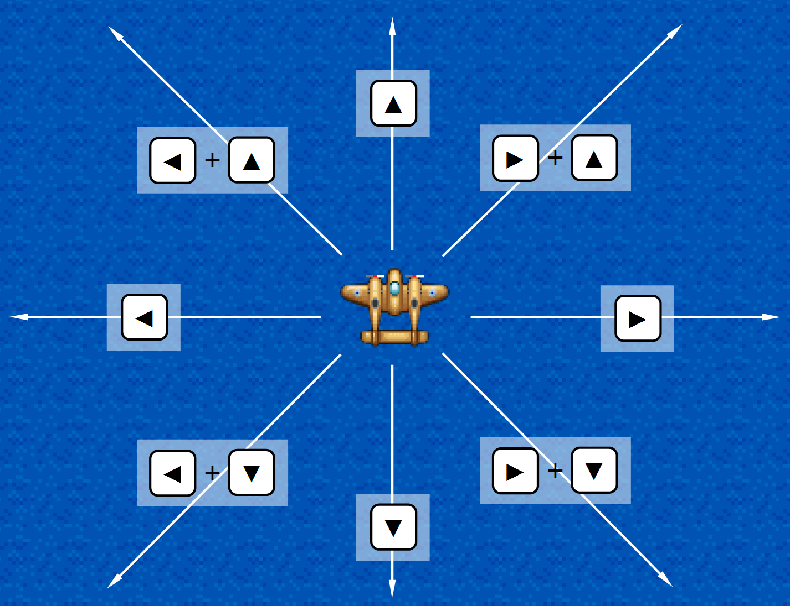
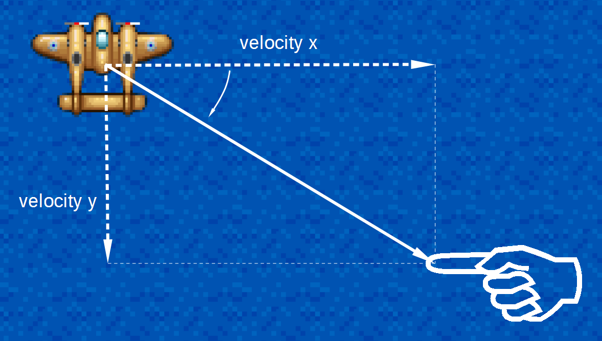
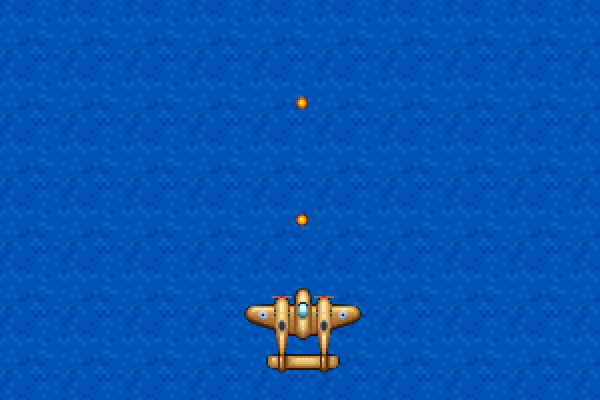
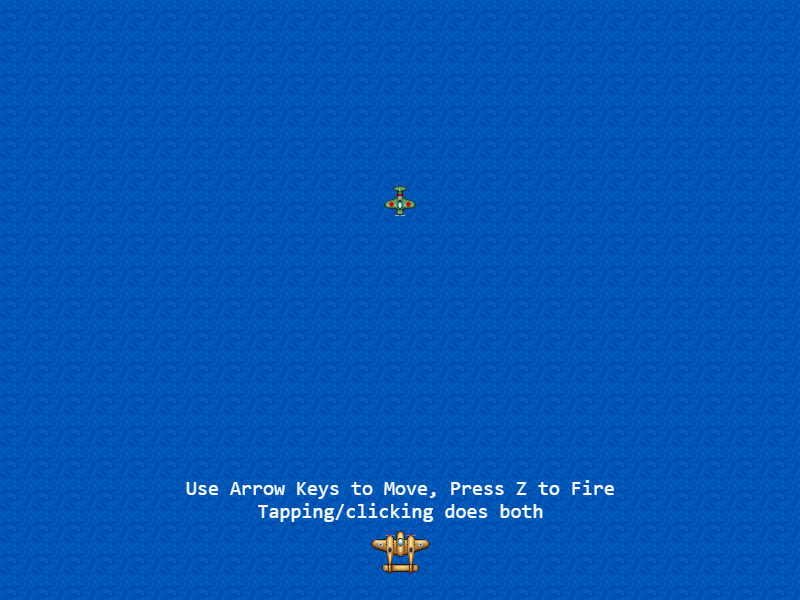

# Afternoon 2: Player Actions

Now that we're done with drawing and movement, let's move on to making an object that will represent us in the game. Load the player sprite in the `preload()` function:

{linenos=off,lang="js"}
~~~~~~~~
  preload: function () {
    this.load.image('sea', 'assets/sea.png');
    this.load.image('bullet', 'assets/bullet.png');
    this.load.spritesheet('greenEnemy', 'assets/enemy.png', 32, 32);
    this.load.spritesheet('explosion', 'assets/explosion.png', 32, 32);
{leanpub-start-insert}
    this.load.spritesheet('player', 'assets/player.png', 64, 64);
{leanpub-end-insert}
  },
~~~~~~~~

Add the following to the `create()` function before the enemy sprite to add our sprite into the game:

{linenos=off,lang="js"}
~~~~~~~~
    this.sea = this.add.tileSprite(0, 0, 800, 600, 'sea');

{leanpub-start-insert}
    this.player = this.add.sprite(400, 550, 'player');
    this.player.anchor.setTo(0.5, 0.5);
    this.player.animations.add('fly', [ 0, 1, 2 ], 20, true);
    this.player.play('fly');
    this.physics.enable(this.player, Phaser.Physics.ARCADE);

{leanpub-end-insert}
    this.enemy = this.add.sprite(400, 200, 'greenEnemy');
~~~~~~~~

## Keyboard Movement

Implementing keyboard-based input is straightforward in _Phaser_. Here we begin by using [a convenience function](http://docs.phaser.io/Phaser.Keyboard.html#createCursorKeys) which returns the four arrow keys. 

{linenos=off,lang="js"}
~~~~~~~~
    this.bullet.anchor.setTo(0.5, 0.5);
    this.enable(this.bullet,  Phaser.Physics.ARCADE);
    this.bullet.body.velocity.y = -400;

{leanpub-start-insert}
    this.cursors = this.input.keyboard.createCursorKeys();
{leanpub-end-insert}
  },
~~~~~~~~

Let's also set the player's initial speed speed as a property of the player object on create since we'll be using this value multiple times throughout our program:

{linenos=off,lang="js"}
~~~~~~~~
    this.player = this.add.sprite(400, 550, 'player');
    this.player.anchor.setTo(0.5, 0.5);
    this.player.animations.add('fly', [ 0, 1, 2 ], 20, true);
    this.player.play('fly');
    this.physics.enable(this.player, Phaser.Physics.ARCADE);
{leanpub-start-insert}
    this.player.speed = 300;
{leanpub-end-insert}

    this.enemy = this.add.sprite(400, 200, 'greenEnemy');
~~~~~~~~

This will also allow us to have planes with different speeds or "speed up" type of power-ups later.

Once that's done, we can now set the velocity like so:

{linenos=off,lang="js"}
~~~~~~~~
  update: function () {
    this.sea.tilePosition.y += 0.2;
    this.physics.arcade.overlap(
      this.bullet, this.enemy, this.enemyHit, null, this
    );

{leanpub-start-insert}
    this.player.body.velocity.x = 0;
    this.player.body.velocity.y = 0;

    if (this.cursors.left.isDown) {
      this.player.body.velocity.x = -this.player.speed;
    } else if (this.cursors.right.isDown) {
      this.player.body.velocity.x = this.player.speed;
    }

    if (this.cursors.up.isDown) {
      this.player.body.velocity.y = -this.player.speed;
    } else if (this.cursors.down.isDown) {
      this.player.body.velocity.y = this.player.speed;
    }
{leanpub-end-insert}
  },
~~~~~~~~

Note that we set the velocity to zero so that the plane stops when the input stops. We also allow the player to input both vertical and horizontal movement at the same time.

Arcade physics also makes it easy to make the edges of the stage act like walls:

{linenos=off,lang="js"}
~~~~~~~~
    this.physics.enable(this.player, Phaser.Physics.ARCADE);
    this.player.speed = 300;
{leanpub-start-insert}
    this.player.body.collideWorldBounds = true;
{leanpub-end-insert}

    this.enemy = this.add.sprite(400, 300, 'greenEnemy');
~~~~~~~~

## Mouse/Touch Movement

Point-based movement usually requires hand-rolling your mathematical calculations. Fortunately, _Phaser_ already has functions which calculates the angle and velocity based on input points. 

Here's how simple it is to move an object towards the pointer:

{linenos=off,lang="js"}
~~~~~~~~
      this.player.body.velocity.y = this.player.speed;
    }

{leanpub-start-insert}
    if (this.input.activePointer.isDown) {
      this.physics.arcade.moveToPointer(this.player, this.player.speed);
    }
{leanpub-end-insert}
  },
~~~~~~~~

Based on the object's location and a speed, the Arcade physics function [`moveToPointer()`](http://docs.phaser.io/Phaser.Physics.Arcade.html#moveToPointer) calculates the angle and velocities required to move towards the pointer at the input speed. Calling this function will already modify the x and y velocities of the object, which is exactly what we need in this situation. 

This function will not rotate the sprite, though, so if you need to rotate the sprite accordingly, you can use the return value of the function which is the angle of rotation in radians. We shall see an example of this in a later lesson.

Just a word of warning, the movement in a frame may overshoot the target (i.e. move 5 pixels even though the pointer is 2 pixels away) causing your player sprite to tremble instead of staying put. The inaccurate coordinates given by a touch screen may also produce a similar effect. A crude way of getting over these is to stop movement at a certain distance from the pressed point, like so:

{linenos=off,lang="js"}
~~~~~~~~
      this.player.body.velocity.y = this.player.speed;
    }

{leanpub-start-delete}
    if (this.input.activePointer.isDown) {
{leanpub-end-delete}
{leanpub-start-insert}
    if (this.input.activePointer.isDown &&
        this.physics.arcade.distanceToPointer(this.player) > 15) {
{leanpub-end-insert}
      this.physics.arcade.moveToPointer(this.player, this.player.speed);
    }
  },
~~~~~~~~

If you need more precise input, you may be better off implementing an on-screen directional pad.

{pagebreak}

## Firing Bullets

Let's remove our old bullet code and add new code for creating bullets on the fly.

{linenos=off,lang="js"}
~~~~~~~~
  create: function () {
    ...
{leanpub-start-delete}
    this.bullet = this.add.sprite(400, 300, 'bullet');
    this.bullet.anchor.setTo(0.5, 0.5);
    this.physics.enable(this.bullet, Phaser.Physics.ARCADE);
    this.bullet.body.velocity.y = -400;
{leanpub-end-delete}
{leanpub-start-insert}
    this.bullets = [];
{leanpub-end-insert}
~~~~~~~~

We set our fire button to Z or tapping/clicking the screen:

{linenos=off,lang="js"}
~~~~~~~~
  update: function () {
    ...
      this.physics.arcade.moveToPointer(this.player, this.player.speed);
    }

{leanpub-start-insert}
    if (this.input.keyboard.isDown(Phaser.Keyboard.Z) ||
        this.input.activePointer.isDown) {
      this.fire();
    }
{leanpub-end-insert}
  },
~~~~~~~~

Then we create a new function that will fire a slightly faster bullet just above the nose of player's sprite:

{linenos=on,starting-line-number=82,lang="js"}
~~~~~~~~
{leanpub-start-insert}
  fire: function() {
    var bullet = this.add.sprite(this.player.x, this.player.y - 20, 'bullet');
    bullet.anchor.setTo(0.5, 0.5);
    this.physics.enable(bullet, Phaser.Physics.ARCADE);
    bullet.body.velocity.y = -500;
    this.bullets.push(bullet);
  },
{leanpub-end-insert}
~~~~~~~~

And finally we modify our collision detection code to iterate over the bullets:

{linenos=off,lang="js"}
~~~~~~~~
  update: function () {
    this.sea.tilePosition.y += 0.2;
{leanpub-start-delete}
    this.physics.arcade.overlap(
      this.bullets, this.enemy, this.enemyHit, null, this
    );
{leanpub-end-delete}
{leanpub-start-insert}
    for (var i = 0; i < this.bullets.length; i++) {
      this.physics.arcade.overlap(
        this.bullets[i], this.enemy, this.enemyHit, null, this
      );
    }
{leanpub-end-insert}
~~~~~~~~

### Fire Rate

One obvious problem that you'll see as you test this new firing code is that the bullets come out at a very high rate. We can throttle this by storing a time value specifying the earliest time when the next bullet can be fired.

Add the variable `nextShotAt` and `shotDelay` (set to 100 milliseconds) to the `create()` function:

{linenos=off,lang="js"}
~~~~~~~~
    this.bullets = [];
{leanpub-start-insert}
    this.nextShotAt = 0;
    this.shotDelay = 100;
{leanpub-end-insert}
~~~~~~~~

Then modify the `fire()` function to check and eventually set the `nextShotAt` variable:

{linenos=off,lang="js"}
~~~~~~~~
  fire: function() {
{leanpub-start-insert}
    if (this.nextShotAt > this.time.now) {
      return;
    }

    this.nextShotAt = this.time.now + this.shotDelay;

{leanpub-end-insert}
    var bullet = this.add.sprite(this.player.x, this.player.y - 20, 'bullet');
    bullet.anchor.setTo(0.5, 0.5);
    this.physics.enable(bullet, Phaser.Physics.ARCADE);
    bullet.body.velocity.y = -500;
    this.bullets.push(bullet);
  },
~~~~~~~~

A> ## How To Play message
A>
A> We don't have time to code a help screen, so let's just flash the "how to play" instructions in the first 10 seconds of every session.
A>
A> Add this to the end of `create()` to [add the text](http://docs.phaser.io/Phaser.GameObjectFactory.html#text):
A> 
A> {linenos=off,lang="js"}
A> ~~~~~~~~
A>     this.instructions = this.add.text( 400, 500, 
A>       'Use Arrow Keys to Move, Press Z to Fire\n' + 
A>       'Tapping/clicking does both', 
A>       { font: '20px monospace', fill: '#fff', align: 'center' }
A>     );
A>     this.instructions.anchor.setTo(0.5, 0.5);
A>     this.instExpire = this.time.now + 10000;
A> ~~~~~~~~
A> 
A> And the end of `update()` to make the text disappear after the time has elapsed:
A>
A> {linenos=off,lang="js"}
A> ~~~~~~~~
A>     if (this.instructions.exists && this.time.now > this.instExpire) {
A>       this.instructions.destroy();
A>     } 
A> ~~~~~~~~
A>
A> 

### Other problems

If you haven't noticed it yet, the _other_ problem with our current bullet generation approach is it's essentially a memory leak. In the next chapter, we'll discuss one way of limiting the resources that our game will use.
